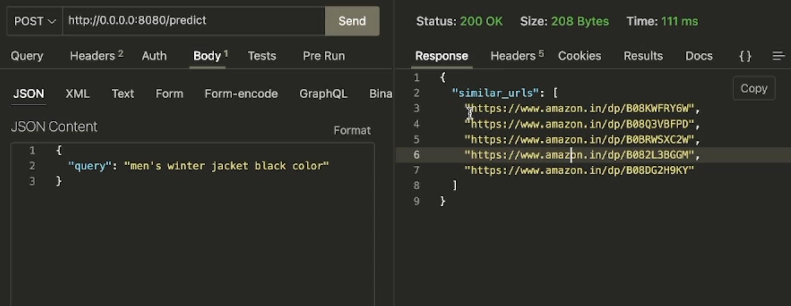

## [HF Space Demo](https://huggingface.co/spaces/kausmos/clothsy)


## [Working Demo](https://youtu.be/LZ-mWgL5qx4)
[](https://youtu.be/LZ-mWgL5qx4)

## Data Collection
To scrape quality clothing data containing proper description and url for the product I used `Apify's` [Amazon Product Scraper](https://blog.apify.com/step-by-step-guide-to-scraping-amazon/#step-1-go-to-amazon-product-scraper-on-apify-store)
By creating an account and logging into the console we can input links of the amazon fashion category like- `Men's Fashion -> Shirts`

I downloaded all the scraped data for various clothing categories into a CSV file with columns `url|title|description`

Apify Console


The full data consists of 2900 different clothing products of men and women, it can be found at `data/clothing_similarity_search.csv`

## Data Cleaning
I used `pandas` to clean the data and preprocess the text data by cleaning it (remove special characters, lowercasing, etc.), and possibly by applying some form of text normalization (like stemming or lemmatization).

## Making Embeddings
`sentence-transformers` has been used to make embeddings for the cleaned data. I used `all-MiniLM-L6-v2` model to make the embeddings. The model card can be found [here](https://huggingface.co/sentence-transformers/all-MiniLM-L6-v2)
```py
from sentence_transformers import SentenceTransformer
sentences = ["This is an example sentence", "Each sentence is converted"]

model = SentenceTransformer('sentence-transformers/all-MiniLM-L6-v2')
embeddings = model.encode(sentences)
print(embeddings)

The choice of this model selection was based on its small size and good accuracy which favors the API response speed
```

The embeddings generated for the whole dataset has been saved into a `.npy` at `/data/embeddings.npy` file which can be loaded and used for similarity search retrieval. This makes sure searching takes place via vector-similarity which is faster.

I used the `cosine similarity` to find the similarity between the embeddings of the query and the embeddings of the products.

## API
Used `FastAPI` to create the API. The API has a single endpoint `/predict` which takes a query string and returns the top 5 most similar products as json

```py
We hit the endpoint http://0.0.0.0:8080/predict with a JSON payload as 
{
    "query": "Men's winter jacket black and white"
}

This will return
{
  "similar_urls": [
    "https://www.amazon.in/dp/B082L3BGGM",
    "https://www.amazon.in/dp/B08KWFRY6W",
    "https://www.amazon.in/dp/B08Q3VBFPD",
    "https://www.amazon.com/dp/B07S1LMK58",
    "https://www.amazon.in/dp/B0B8YY38VF"
  ]
}
```

## Deployment
I used `Docker` to containerize the API. Was trying to use Google Cloud Functions to deploy the endpoint but faced some issues since it was my first time using GCP:-
- Wasn't able to load the `embeddings.npy` file from cloud storage into the cloud function. Some help on this would be appreciated.

## Running Locally
- Clone the repo
- Make a virtual environment
- Install the dependencies `pip install -r requirements.txt`
- Run the server `python main.py`